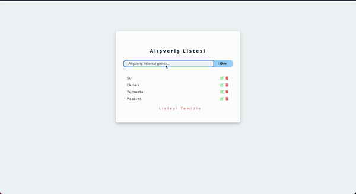

# Product Management CRUD App

**Product Management CRUD App** is a JavaScript application that allows users to manage a list of products. Users can add new products, edit existing ones, and delete products as needed.

## Features

- **Add Products**: Easily add new products with relevant details.
- **Edit Products**: Update information of existing products.
- **Delete Products**: Remove products from the list.
- **Data Persistence**: Product data is saved in local storage, ensuring data retention even after refreshing the page.

## Technologies Used

- **JavaScript**: Core programming language for the app’s functionality.
- **HTML/CSS**: Used for building and styling the user interface.

